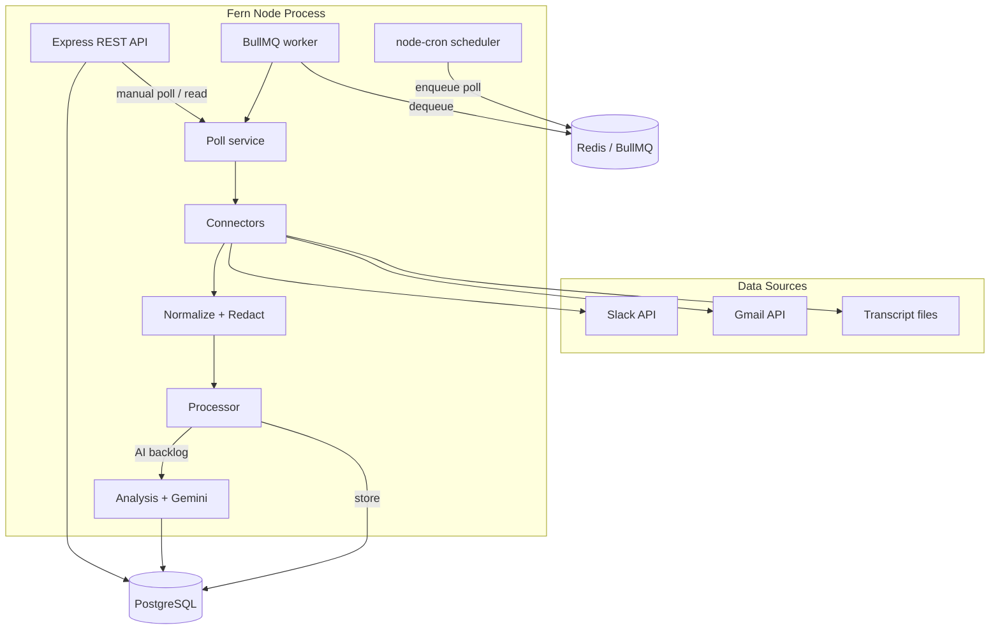
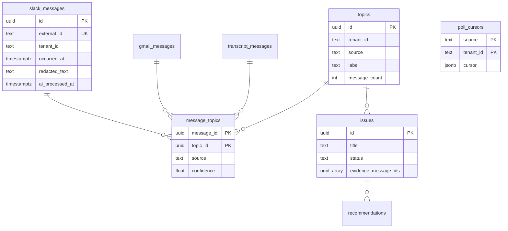
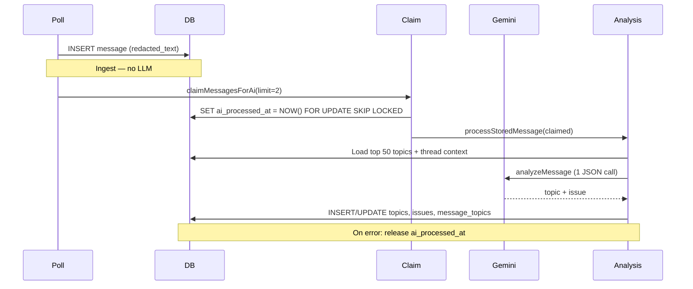

# Fern — System Design Summary (Interview)

This document explains how Fern is built, why key decisions were made, and what would break or cost money at scale. It maps directly to the codebase in this repository.

---

## 1. Architecture

### What Fern does

Fern is a **polling-based ingestion + analysis pipeline**. It pulls data from Slack, Gmail, and local meeting transcripts every five minutes, normalizes and redacts it, stores it in Postgres, and runs Google Gemini to extract **topics**, **open issues**, and (on demand) **recommendations**.

The design goal is **simplicity and cost control** for an MVP: one Node process, one database, one Redis instance, and a single LLM provider.

### High-level diagram



### Layer breakdown

| Layer | Responsibility | Why it exists |
|-------|----------------|---------------|
| **Connectors** | Source-specific fetch logic + cursor updates | Each API (Slack history, Gmail `historyId`, filesystem) has different pagination. Isolating this behind a common `Connector` interface keeps the poll loop source-agnostic. |
| **Pipeline** | Normalize to `RawEvent`, redact PII | A single internal shape lets one processor handle all sources. Redaction runs **before** persistence and AI so we never send raw emails/phones to Gemini. |
| **Processor** | Store messages; run AI on backlog | **Ingest and AI are decoupled.** Ingest is fast and reliable; AI is slow, rate-limited, and can fail without losing data. |
| **Analysis** | One Gemini call → topic + issue | Reduces LLM cost and latency vs. multiple calls per message. |
| **Queue + scheduler** | Async poll jobs, worker isolation | Cron enqueues work; BullMQ runs it so HTTP handlers stay responsive. Concurrency is set to **1** for poll jobs to avoid duplicate processing. |
| **REST API** | Read results, trigger polls, live previews | Operators and future UI can inspect stored data and source health without waiting for the next cron tick. |

### Request / job flow (one poll cycle)

1. **Cron** (every `POLL_INTERVAL_MINUTES`) enqueues `{ tenantId }` on `fern-ingest`.
2. **Worker** calls `runPollCycle(tenantId)`.
3. For each connector (slack → gmail → transcript):
   - Load **poll cursor** from `poll_cursors`.
   - Fetch new events since cursor.
   - **Store only** via `processBatch` (no Gemini).
   - Optionally run **AI backlog** (`reprocessUnprocessed`), capped by `AI_REPROCESS_PER_POLL`.
   - Save updated cursor.
4. A **mutex** (`pollCycleInFlight`) prevents overlapping poll cycles if startup poll and cron fire together.

### Why polling instead of webhooks?

| Polling (chosen) | Webhooks / streaming |
|------------------|----------------------|
| One cron + cursors; easy to reason about | Per-source subscription setup (Slack Events API, Gmail Pub/Sub) |
| Works for local transcript files | Files still need polling anyway |
| Natural backpressure via `AI_REPROCESS_PER_POLL` | Bursts need separate queue tuning |
| 5-minute latency is acceptable for this use case | Better for real-time alerts |

**Reason:** For an interview MVP analyzing workplace comms, **near-real-time (minutes)** is enough. Polling unifies three heterogeneous sources behind one loop and avoids operating three push pipelines on day one.

### Multi-tenancy

`tenant_id` is threaded through messages, topics, issues, and cursors. The default tenant is `default`. The schema supports multiple tenants without separate databases — a deliberate tradeoff for simpler ops at small scale (see §4).

---

## 2. Database design

### Design principles

1. **Source-specific message tables** — `slack_messages`, `gmail_messages`, `transcript_messages` instead of one `messages` table.
2. **Idempotent ingest** — `UNIQUE (tenant_id, external_id)` with `ON CONFLICT DO UPDATE` so re-polls upsert instead of duplicating.
3. **Explicit AI completion** — `ai_processed_at` on each message table, independent of whether a topic was created.
4. **Derived intelligence in normalized tables** — `topics`, `issues`, `message_topics`, `recommendations`.
5. **JSONB cursors** — `poll_cursors.cursor` stores opaque per-source state (Slack `channelCursors`, Gmail `historyId`, transcript `processedFiles`).

### Entity relationship (simplified)



### Why separate tables per source?

**Pros:**
- Source-specific indexes and retention policies later (e.g. drop raw Gmail bodies after 90 days).
- Clearer debugging (“20 gmail rows, 2 slack rows”).
- No nullable “source-specific” columns polluting one wide table.

**Cons:**
- Repositories need a `source → table` map.
- Cross-source queries (e.g. “all recent messages”) require `UNION` or parallel queries.

**Reason:** Workplace data sources have different volumes, fields, and compliance rules. Separating early avoids a painful migration when Gmail volume dwarfs Slack.

### `ai_processed_at` — why not only `message_topics`?

Initially, “processed” meant “has a topic row.” That failed when:
- Gemini ran but returned no actionable topic (newsletters, casual chat).
- Topic assignment failed validation (hallucinated `topicId`).

Those messages were **re-analyzed on every server restart**, wasting API quota.

**Solution:** `ai_processed_at` is set when we **claim** a message for AI (`FOR UPDATE SKIP LOCKED`). On failure, the claim is **released** so retry is possible. On success, the timestamp stays — the message never re-enters the backlog.

Partial index for the hot path:

```sql
CREATE INDEX idx_gmail_messages_unprocessed
  ON gmail_messages (tenant_id, occurred_at DESC)
  WHERE ai_processed_at IS NULL;
```

**Reason:** The partial index keeps “find unprocessed” fast as the table grows; completed rows are excluded from the index.

### Issue deduplication (DB + app)

Issues store `evidence_message_ids UUID[]` and are deduped in application code by **case-insensitive title match** against open issues — not a second LLM call.

**Reason:** Title match is cheap and good enough for MVP. A semantic dedup (embeddings or `matchExistingIssue` LLM call) is available in `llm.service.ts` but not wired into the main path to save cost.

### What we intentionally did not build (yet)

- Full audit log / event sourcing
- Vector embeddings table for semantic search
- Row-level security per tenant in Postgres
- Soft deletes on messages

---

## 3. AI pipeline + costs

### Pipeline stages



### One call per message (main cost lever)

Originally the pipeline could call Gemini separately for:
- topic classification
- topic summarization
- issue extraction
- issue matching

That is **4× cost and 4× rate-limit exposure** per message.

**Current approach:** `analyzeMessage()` returns both `topic` and `issue` in a single `generateContent` request with `responseMimeType: application/json`.

**Reason:** Topic and issue extraction read the same text. One structured prompt is the highest ROI optimization for this workload.

Recommendations remain a **separate on-demand call** (`generateRecommendationsWithAI`) because they are user-specific and not needed on every ingest.

### Context window sent to Gemini

Per `analyzeMessage` call, the payload roughly includes:

| Input | Limit | Purpose |
|-------|-------|---------|
| Message text | Full redacted body | Primary signal |
| Existing topics | Top 50 by `last_seen_at` | Assign vs. create |
| Thread context | Up to 10 messages | Disambiguate replies |
| System prompt | ~500 tokens | JSON schema instructions |

**Reason for 50 topics:** Sending every topic ever created would grow without bound. Recent topics are most likely matches; stale topics can be re-created if needed (acceptable MVP imperfection).

### Rate limiting and quota (free tier)

Fern enforces limits in **three layers**:

| Control | Default | Effect |
|---------|---------|--------|
| `GEMINI_MIN_DELAY_MS` | 5000 | Serial queue; ~12 requests/minute |
| `AI_REPROCESS_PER_POLL` | 2 per source | Max 6 AI calls per 5-min poll |
| `AI_REPROCESS_ON_STARTUP` | false | No AI burst on `npm run dev` restart |

**Model:** `gemini-2.5-flash-lite` — chosen because older `gemini-2.0-*` models returned **free-tier quota = 0** after Google shut them down.

**Free-tier ballpark (Gemini API, project-level):**

| Limit type | gemini-2.5-flash-lite (approx.) |
|------------|----------------------------------|
| RPM | ~15 requests/minute |
| RPD | ~1,000 requests/day |

**Projected usage at defaults:**

```
6 calls/poll × 288 polls/day ≈ 1,728 calls/day
```

That **exceeds** free-tier RPD. The app logs a startup warning. To stay under ~1,000/day: set `AI_REPROCESS_PER_POLL=1` or `POLL_INTERVAL_MINUTES=10`.

### Cost estimate (paid tier, order of magnitude)

Flash-Lite pricing is low (fractions of a cent per 1K tokens; check current Google pricing). Illustrative math for **1,000 messages/day**:

| Assumption | Value |
|------------|-------|
| Calls/message | 1 (`analyzeMessage`) |
| Input tokens/call | ~2,000 (message + 50 topics + prompt) |
| Output tokens/call | ~300 (JSON) |
| Daily input | 2M tokens |
| Daily output | 300K tokens |

At typical Flash-Lite rates, this is **well under $1/day** for ingestion analysis. Recommendations add cost proportional to how often users call `/generate`.

**Reason for caring about cost early:** LLM spend scales linearly with message volume; regex PII + combined prompts + per-poll caps are cheap guardrails before you need billing dashboards.

### Failure handling

| Failure | Behavior |
|---------|----------|
| Gemini 429 (rate limit) | Parse `RetryInfo`, backoff, retry up to `GEMINI_MAX_RETRIES` |
| Gemini 404 / limit: 0 | Fail fast with model migration hint (no pointless 36s retry) |
| Invalid JSON from model | Log snippet, throw — claim released, retry next poll |
| No `GOOGLE_AI_API_KEY` | Store messages; skip AI |

**Reason:** Ingest must never depend on AI availability. Messages are durable; intelligence is eventually consistent.

---

## 4. Tradeoffs

### 4.1 Polling vs. event-driven ingestion

**Chosen:** 5-minute poll with cursors.  
**Gave up:** Sub-minute latency, automatic reaction to every Slack message.  
**Why:** Operational simplicity and unified loop across file + API sources.

### 4.2 Store-first, AI-later

**Chosen:** `processBatch` only inserts; AI runs in `reprocessUnprocessed`.  
**Gave up:** Immediate topic/issue on ingest.  
**Why:** Gmail backfill can fetch 20 emails at once; running Gemini on all of them would blow RPM/RPD. Decoupling lets ingest complete in seconds while AI trickles through backlog.

### 4.3 Combined LLM call vs. modular prompts

**Chosen:** Single `analyzeMessage` JSON response.  
**Gave up:** Independent tuning of topic vs. issue prompts; easier per-step observability.  
**Why:** 75% fewer API calls. For interview scope, one well-structured prompt is the right default.

### 4.4 Regex PII redaction vs. ML / DLP

**Chosen:** Pattern-based redaction (`[EMAIL]`, `[PHONE]`, tokens like `xoxb-`).  
**Gave up:** Catches obfuscated or contextual PII (names, addresses in prose).  
**Why:** Zero latency, zero cost, deterministic — good enough before compliance requirements harden.

### 4.5 Title-based issue dedup vs. embedding / LLM match

**Chosen:** Case-insensitive title equality in `applyIssue`.  
**Gave up:** “Fix login bug” vs. “Login issue on prod” merge correctly.  
**Why:** No extra LLM call; `matchExistingIssue()` exists for a future upgrade path.

### 4.6 Postgres-only vs. Postgres + Elasticsearch + vector DB

**Chosen:** Single Postgres for messages, topics, issues.  
**Gave up:** Full-text search at scale, semantic “similar issues” queries.  
**Why:** MVP read paths are list-by-tenant with limits (50–100 rows). Postgres indexes suffice until full-text or vector requirements appear.

### 4.7 BullMQ + in-process workers vs. separate worker fleet

**Chosen:** Workers start inside the Express process when `ENABLE_BACKGROUND_JOBS=true`.  
**Gave up:** Independent scaling of API vs. workers.  
**Why:** One deployable unit for demo/interview; queue abstraction still allows splitting later.

### 4.8 `tenant_id` column vs. database-per-tenant

**Chosen:** Shared schema, `tenant_id` filter everywhere.  
**Gave up:** Hard isolation for enterprise customers.  
**Why:** Faster to build; acceptable for internal tooling until compliance demands separation.

---

## 5. Potential bottlenecks

### 5.1 Gemini API (most likely first bottleneck)

| Symptom | Cause | Mitigation |
|---------|-------|------------|
| 429 errors | RPM/RPD exceeded | Lower `AI_REPROCESS_PER_POLL`, raise `GEMINI_MIN_DELAY_MS`, enable billing |
| Growing backlog | AI slower than ingest | Dedicated worker pool, batch API, or skip low-value messages (e.g. newsletters) |
| Serial queue | `runSerialGemini` — one call at a time per process | Multiple worker processes with partitioned tenants (each still rate-limited per API key) |

**Reason:** External API quota is the ceiling for any LLM-first design. Everything else can scale horizontally; the API key cannot (quota is per Google Cloud project).

### 5.2 AI backlog lag

With `AI_REPROCESS_PER_POLL=2` and 3 sources, max **6 messages per 5 minutes** ≈ **1,728 messages/day** theoretical — but only if polls never skip.

A burst of 500 Gmail backfill messages takes **~500 / 6 × 5 min ≈ 7 hours** to analyze.

**Mitigation:** Priority queue (Slack before Gmail), dynamic limit based on backlog depth, or pre-filter (skip auto-generated mail).

### 5.3 Poll cycle duration (sequential connectors)

Connectors run **sequentially** in one `for` loop. Slow Gmail API + Slack pagination extends cycle time.

**Mitigation:** `Promise.all` per connector with isolated cursors (already independent in DB); watch Slack rate limits.

### 5.4 Topic list growth degrading prompt quality

Sending 50 topics works at hundreds of topics; at **thousands**, prompts bloat and assignment accuracy drops.

**Mitigation:** Embedding retrieval (top-K similar topics), hierarchical topics, or periodic topic merge job.

### 5.5 Issue list scan for deduplication

`applyIssue` loads all open issues for a tenant/source and linear-scans for title match.

**Mitigation:** Unique index on `lower(title)` where `status IN ('open','in_progress')`, or pg_trgm fuzzy match.

### 5.6 Postgres write amplification

Each analyzed message may touch: message row (claim), `message_topics`, `topics` (count bump), `issues`.

**Mitigation:** Batch topic count updates; defer non-critical writes.

### 5.7 Single Redis / single Postgres

BullMQ and Postgres are SPoFs for background processing.

**Mitigation:** Managed Redis/Postgres with replicas; run multiple API instances with **one** ingest worker consumer group or Redis distributed lock (poll mutex is in-memory today — **does not protect across multiple Node processes**).

### 5.8 In-memory poll mutex (multi-instance gap)

`pollCycleInFlight` only guards within **one process**. Two Fern replicas could run duplicate poll cycles.

**Mitigation:** Redis `SETNX` lock or BullMQ job deduplication keyed by `tenantId + minute`.

---

## Summary table (interview cheat sheet)

| Area | Decision | Primary reason |
|------|----------|----------------|
| Architecture | Poll + store + async AI backlog | Cost control, reliability, unified sources |
| Database | Per-source tables + `ai_processed_at` | Clarity, idempotent ingest, no duplicate AI |
| AI | 1 Gemini call/message (topic + issue) | Minimize cost and rate limits |
| Rate limits | Serial queue + per-poll cap | Stay within free tier / predictable spend |
| Tradeoff | Polling over webhooks | Simpler MVP; minutes latency OK |
| First bottleneck | Gemini quota | Scale AI carefully before scaling infra |
| Multi-instance gap | In-memory poll mutex | Documented; fix with distributed lock |

---

## If asked “what would you do next?”

1. **Distributed poll lock** (Redis) for horizontal scaling.
2. **Embedding-based topic retrieval** instead of fixed top-50 list.
3. **Webhook ingestion for Slack** where real-time matters; keep poll for Gmail/files.
4. **Metrics**: backlog depth, Gemini latency, cost per tenant, poll duration.
5. **Classification gate**: skip obvious noise (calendar invites, marketing) before Gemini.

These are natural extensions of the current design — not rewrites.
